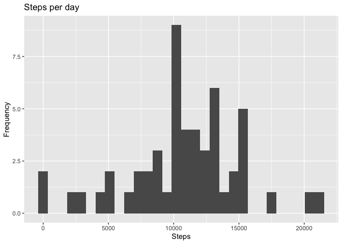
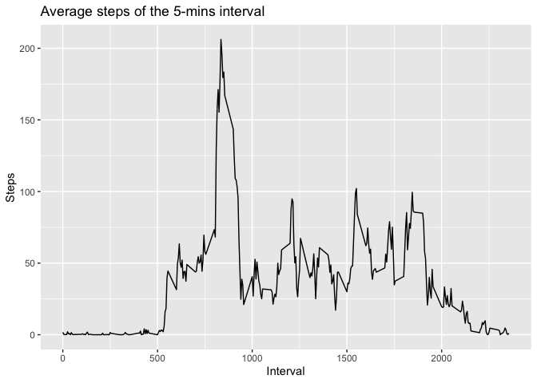
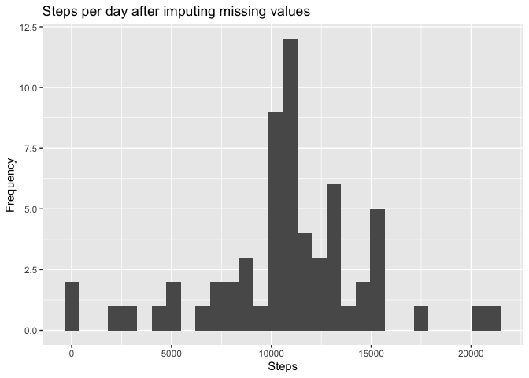
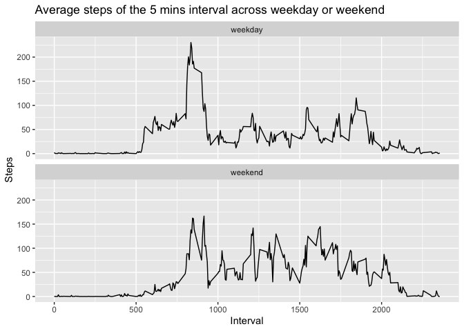

  
  
### Loading and preprocessing the data  
1. Load the data    

```r
data <- read.csv(unzip("activity.zip"), header = TRUE, sep = ",")
str(data)
```

```
## 'data.frame':	17568 obs. of  3 variables:
##  $ steps   : int  NA NA NA NA NA NA NA NA NA NA ...
##  $ date    : Factor w/ 61 levels "2012-10-01","2012-10-02",..: 1 1 1 1 1 1 1 1 1 1 ...
##  $ interval: int  0 5 10 15 20 25 30 35 40 45 ...
```
2. Preprocessing the data    

```r
data$date <- as.Date(data$date)
str(data)
```

```
## 'data.frame':	17568 obs. of  3 variables:
##  $ steps   : int  NA NA NA NA NA NA NA NA NA NA ...
##  $ date    : Date, format: "2012-10-01" "2012-10-01" ...
##  $ interval: int  0 5 10 15 20 25 30 35 40 45 ...
```
### What is mean total number of steps taken per day?    
1. Make a histogram of the total number of steps taken each day    

```r
steps_date <- aggregate(steps~date, data = data, sum)
q1 <- ggplot(steps_date, aes(steps))
q1 + geom_histogram() + labs(title = "Steps per day", x = "Steps", y = "Frequency")
```

```
## `stat_bin()` using `bins = 30`. Pick better value with `binwidth`.
```

<!-- -->
  
2. Calculate and report the **mean** and **median** total number of steps taken per day    

```r
mean_steps <- mean(steps_date$steps)
median_steps <- median(steps_date$steps)
```
mean = 1.0766189\times 10^{4}  
median = 10765  

### What is the average daily activity pattern?  
1. Make a time series plot (i.e. `type = "l"`) of the 5-minute interval (x-axis) and the average number of steps taken, averaged across all days (y-axis)  


```r
steps_5mins <- aggregate(steps~interval, data = data, mean)
m <- ggplot(steps_5mins, aes(interval, steps))
m + geom_line() + labs(title = "Average steps of the 5-mins interval", x = "Interval", y = "Steps")
```

<!-- -->

2. Which 5-minute interval, on average across all the days in the dataset, contains the maximum number of steps?  


```r
max_steps <- steps_5mins[which.max(steps_5mins$steps),]
print(max_steps)
```

```
##     interval    steps
## 104      835 206.1698
```

### Imputing missing values  
Note that there are a number of days/intervals where there are missing
values (coded as `NA`). The presence of missing days may introduce
bias into some calculations or summaries of the data.  

1. Calculate and report the total number of missing values in the dataset (i.e. the total number of rows with `NA`s)  


```r
missing <- sum(is.na(data$steps))
```
Total number of missing values = 2304  

2. Devise a strategy for filling in all of the missing values in the dataset. The strategy does not need to be sophisticated. For example, you could use the mean/median for that day, or the mean for that 5-minute interval, etc.  

We impute the missing values of steps with the mean of the 5 mins intervals.  

3. Create a new dataset that is equal to the original dataset but with the missing data filled in.  


```r
library(dplyr)
```

```
## 
## Attaching package: 'dplyr'
```

```
## The following objects are masked from 'package:data.table':
## 
##     between, first, last
```

```
## The following objects are masked from 'package:stats':
## 
##     filter, lag
```

```
## The following objects are masked from 'package:base':
## 
##     intersect, setdiff, setequal, union
```

```r
data_impute_na <- data
data_impute_na <- data_impute_na %>% group_by(interval) %>% mutate(steps = ifelse(is.na(steps), mean(steps, na.rm = TRUE), steps) )
sum(is.na(data_impute_na))
```

```
## [1] 0
```

```r
head(data_impute_na)
```

```
## # A tibble: 6 x 3
## # Groups:   interval [6]
##    steps date       interval
##    <dbl> <date>        <int>
## 1 1.72   2012-10-01        0
## 2 0.340  2012-10-01        5
## 3 0.132  2012-10-01       10
## 4 0.151  2012-10-01       15
## 5 0.0755 2012-10-01       20
## 6 2.09   2012-10-01       25
```

4. Make a histogram of the total number of steps taken each day and Calculate and report the **mean** and **median** total number of steps taken per day. Do these values differ from the estimates from the first part of the assignment? What is the impact of imputing missing data on the estimates of the total daily number of steps?  


```r
steps_date_na <- aggregate(steps~date, data = data_impute_na, sum)
q2 <- ggplot(steps_date_na, aes(steps))
q2 + geom_histogram() + labs(title = "Steps per day after imputing missing values", x = "Steps", y = "Frequency")
```

```
## `stat_bin()` using `bins = 30`. Pick better value with `binwidth`.
```

<!-- -->

```r
mean_steps <- mean(steps_date_na$steps)
median_steps <- median(steps_date_na$steps)
```

mean_na = 1.0766189\times 10^{4}  
median_na = 1.0766189\times 10^{4}  
  
As we can see both mean and median of steps taken per day became exactly same which was not the case prior to imputing missing values  
  
  
### Are there differences in activity patterns between weekdays and weekends?  

For this part the `weekdays()` function may be of some help here. Use
the dataset with the filled-in missing values for this part.  
  
1. Create a new factor variable in the dataset with two levels -- "weekday" and "weekend" indicating whether a given date is a weekday or weekend day.  


```r
weekday <- ifelse(weekdays(data_impute_na$date) %in% c("Saturday", "Sunday"), "weekend", "weekday")
data_impute_na$weekday <- as.factor(weekday)
head(data_impute_na)
```

```
## # A tibble: 6 x 4
## # Groups:   interval [6]
##    steps date       interval weekday
##    <dbl> <date>        <int> <fct>  
## 1 1.72   2012-10-01        0 weekday
## 2 0.340  2012-10-01        5 weekday
## 3 0.132  2012-10-01       10 weekday
## 4 0.151  2012-10-01       15 weekday
## 5 0.0755 2012-10-01       20 weekday
## 6 2.09   2012-10-01       25 weekday
```
  
2. Make a panel plot containing a time series plot (i.e. `type = "l"`) of the 5-minute interval (x-axis) and the average number of steps taken, averaged across all weekday days or weekend days (y-axis)  


```r
steps_weekday <- aggregate(steps~interval + weekday, data = data_impute_na, mean)
p <- ggplot(steps_weekday, aes(interval, steps))
p + geom_line() + facet_wrap(.~weekday, nrow = 2, ncol = 1) + labs(title = "Average steps of the 5 mins interval across weekday or weekend", x = "Interval", y = "Steps")
```

<!-- -->


